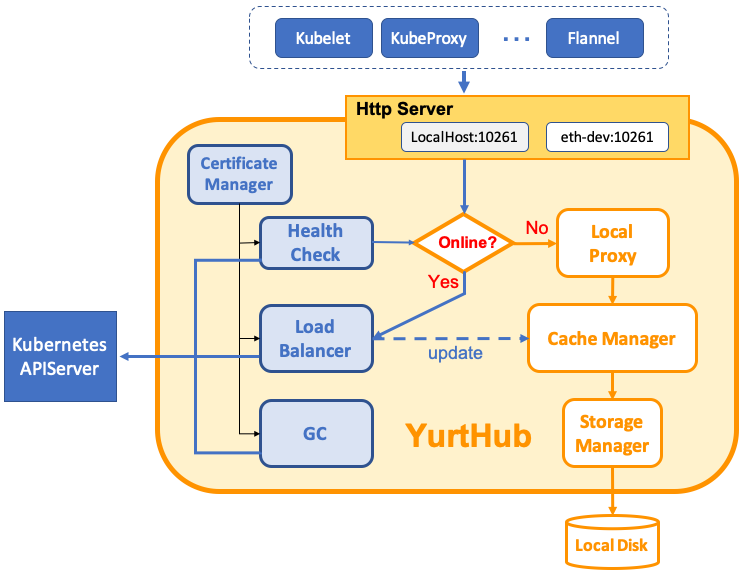

# 边缘网关缓存能力的优雅实现
2021-03-29  **阿里巴巴云原生**


## OpenYurt如何解决边缘自治问题

想要实现将 Kubernetes 系统延展到边缘计算场景，那么边缘节点将通过公网和云端连接，网络连接有很大不可控因素，可能带来边缘业务运行的不稳定因素，这是云原生和边缘计算融合的主要难点之一。

解决这个问题，需要使边缘侧具有自治能力，即当云边网络断开或者连接不稳定时，确保边缘业务可以持续运行。在 OpenYurt 中，该能力由 yurt-controller-manager 和 YurtHub 组件提供。

### 1）Yurthub架构
在之前的文章中，我们详细介绍了YurtHub 组件的能力。其架构图如下：


YurtHub是一个带有数据缓存功能的“透明网关”，和云端网络断连状态下，如果节点或者组件重启，各个组件（kubelet/kube-proxy 等)将从 YurtHub 中获取到业务容器相关数据，有效解决边缘自治的问题。这也意味着我们需要实现一个轻量的带数据缓存能力的反向代理。


### 2）第一想法
实现一个缓存数据的反向代理，第一想法就是从 response.Body 中读取数据，然后分别返回给请求 client 和本地的 Cache 模块。伪代码如下:
```
func HandleResponse(rw http.ResponseWriter, resp *http.Response) {
        bodyBytes, _ := ioutil.ReadAll(resp.Body)
        go func() {
                // cache response on local disk
                cacher.Write(bodyBytes)
        }

        // client reads data from response
        rw.Write(bodyBytes)
}
```

当深入思考后，在 Kubernetes 系统中，上述实现会引发下面的问题：

- 问题 1：流式数据需要如何处理(如: K8s 中的 watch 请求)，意味 ioutil.ReadAll() 一次调用无法返回所有数据。即如何可以返回流数据同时又缓存流数据。

- 问题 2：同时在本地缓存数据前，有可能需要对传入的 byte slice 数据先进行清洗处理。这意味着需要修改 byte slice，或者先备份 byte slice 再处理。这样会造成内存的大量消耗，同时针对流式数据，到底申请多大的 slice 也不好处理。


### 3) 优雅实现探讨


针对上面的问题，我们将问题逐个抽象，可以发现更优雅的实现方法。

- 问题 1：如何对流数据同时进行读写

针对流式数据的读写(一边返回一边缓存)，如下图所示，其实需要的不过是把 response.Body(io.Reader) 转换成一个 io.Reader 和一个 io.Writer。或者说是一个 io.Reader 和 io.Writer 合成一个 io.Reader。这很容易就联想到 Linux 里面的 Tee 命令。


而在 Golang 中 Tee 命令是实现就是 io.TeeReader，那问题 1 的伪代码如下:
``` 
func HandleResponse(rw http.ResponseWriter, resp *http.Response) {
        // create TeeReader with response.Body and cacher
        newRespBody := io.TeeReader(resp.Body, cacher)

        // client reads data from response
        io.Copy(rw, newRespBody)
}
```

通过 TeeReader 的对 Response.Body 和 Cacher 的整合，当请求 client 端从 response.Body 中读取数据时，将同时向 Cache 中写入返回数据，优雅的解决了流式数据的处理。

- 问题 2：如何在缓存前先清洗流数据

如下图所示，缓存前先清洗流数据，请求端和过滤端需要同时读取 response.Body（2 次读取问题）。也就是需要将 response.Body(io.Reader) 转换成两个 io.Reader。


也意味着问题 2 转化成：问题 1 中缓存端的 io.Writer 转换成 Data Filter 的 io.Reader。其实在 Linux 命令中也能找到类似命令，就是管道。因此问题 2 的伪代码如下：
``` 
func HandleResponse(rw http.ResponseWriter, resp *http.Response) {
        pr, pw := io.Pipe()
        // create TeeReader with response.Body and Pipe writer
        newRespBody := io.TeeReader(resp.Body, pw)
        go func() {
                // filter reads data from response 
                io.Copy(dataFilter, pr)
        }

        // client reads data from response
        io.Copy(rw, newRespBody)
}
```
通过 io.TeeReader 和 io.PiPe，当请求 client 端从 response.Body 中读取数据时，Filter 将同时从 Response 读取到数据，优雅的解决了流式数据的 2 次读取问题。

## YurtHub实现
最后看一下 YurtHub 中相关实现，由于 Response.Body 为 io.ReadCloser，所以实现了 dualReadCloser。同时 YurtHub 可能也面临对 http.Request 的缓存，所以增加了 isRespBody 参数用于判定是否需要负责关闭 response.Body。
``` 
// https://github.com/openyurtio/openyurt/blob/master/pkg/yurthub/util/util.go#L156
// NewDualReadCloser create an dualReadCloser object
func NewDualReadCloser(rc io.ReadCloser, isRespBody bool) (io.ReadCloser, io.ReadCloser) {
    pr, pw := io.Pipe()
    dr := &dualReadCloser{
        rc:         rc,
        pw:         pw,
        isRespBody: isRespBody,
    }

    return dr, pr
}

type dualReadCloser struct {
    rc io.ReadCloser
    pw *io.PipeWriter
    // isRespBody shows rc(is.ReadCloser) is a response.Body
    // or not(maybe a request.Body). if it is true(it's a response.Body),
    // we should close the response body in Close func, else not,
    // it(request body) will be closed by http request caller
    isRespBody bool
}

// Read read data into p and write into pipe
func (dr *dualReadCloser) Read(p []byte) (n int, err error) {
    n, err = dr.rc.Read(p)
    if n > 0 {
        if n, err := dr.pw.Write(p[:n]); err != nil {
            klog.Errorf("dualReader: failed to write %v", err)
            return n, err
        }
    }

    return
}

// Close close two readers
func (dr *dualReadCloser) Close() error {
    errs := make([]error, 0)
    if dr.isRespBody {
        if err := dr.rc.Close(); err != nil {
            errs = append(errs, err)
        }
    }

    if err := dr.pw.Close(); err != nil {
        errs = append(errs, err)
    }

    if len(errs) != 0 {
        return fmt.Errorf("failed to close dualReader, %v", errs)
    }

    return nil
}
```

在使用 dualReadCloser 时，可以在 httputil.NewSingleHostReverseProxy 的 modifyResponse() 方法中看到。代码如下：
``` 
// https://github.com/openyurtio/openyurt/blob/master/pkg/yurthub/proxy/remote/remote.go#L85
func (rp *RemoteProxy) modifyResponse(resp *http.Response) error {rambohe-ch, 10 months ago: • hello openyurt
            // 省略部分前置检查                                                          
            rc, prc := util.NewDualReadCloser(resp.Body, true)
            go func(ctx context.Context, prc io.ReadCloser, stopCh <-chan struct{}) {
                err := rp.cacheMgr.CacheResponse(ctx, prc, stopCh)
                if err != nil && err != io.EOF && err != context.Canceled {
                    klog.Errorf("%s response cache ended with error, %v", util.ReqString(req), err)
                }
            }(ctx, prc, rp.stopCh)

            resp.Body = rc
}
```

## 总结
OpenYurt 于 2020 年 9 月进入 CNCF 沙箱后，持续保持了快速发展和迭代，在社区同学一起努力下，目前已经开源的能力有：

- 边缘自治
- 边缘单元化管理
- 云边协同运维
- 一键式无缝转换能力

[原文链接](https://mp.weixin.qq.com/s/vdFrCDiIhPLVbOnf6vRxEw)
