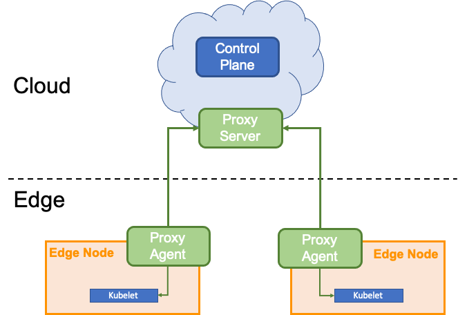
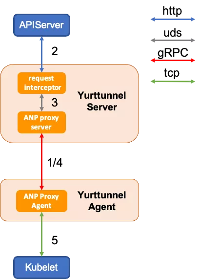
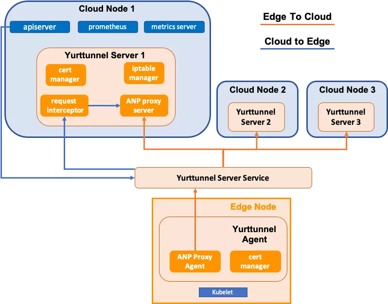

# 如何构建Kubernetes原生云边高效协同网络
2020-11-06   **阿里巴巴云原生**

导读：OpenYurt是阿里巴巴开源的云边协同一体化架构，与同类开源方案相比，OpenYurt拥有可实现边缘计算全场景覆盖的能力。
- OpenYurt是如何在弱网和断网环境下实现边缘自治的——[YurtHub](./Elegant_realization_of_edge_gateway_caching_capabilities.md)
- OpenYurt另一个核心能力——云边通信，以及相关组件Yurttunnel

## Yurttunnel使用场景

在应用的部署和运维过程中，用户常常需要获取应用的日志，或直接登录到应用的运行环境中进行调试。在 Kubernetes 环境中，我们通常使用 kubectl log，kubectl exec 等指令来实现这些需求。如下图所示，在 kubectl 请求链路上， kubelet 将扮演服务器端，负责处理由 kube-apiserver(KAS) 转发来的请求，这就要求 KAS 和 kubelet 之间需要存在一条网络通路，允许 KAS 主动访问 kubelet。

然而，在边缘计算场景中，边缘节点常位于本地专有网络中，这虽然保证了边缘节点的安全，但也造成位于云端管控节点的KAS无法直接访问位于边缘节点的kubelet。因此，为了支持通过云端节点对边缘端应用进行运维操作，我们必须在云、边之间建立反向运维通道。

## 反向通道
Yurttunnel是OpenYurt近期开源的一个重要组件，用来解决云边通信问题。反向通道是解决跨网络通信的一种常见方式，而 Yurttunnel 的本质就是一个反向通道。一个边缘集群下属的节点常位于不同的 network region 中，而位于同一个 region 内的节点之间是可以相互通信的，因此在设置反向通道时，我们只需保证在每个 region 内设置一个与 proxy server 相连的 agent 即可。具体包括以下几个步骤：

- 在管控组件所在网络内，部署 proxy server。

- proxy server 对外开放一个公网可以访问的 IP。

- 在每个 region 部署个 agent，并通过 server 的公网 IP 与 server 建立长连接。

- 管控组件对边缘节点的访问请求都将转发致 proxy server。

- proxy server 再将请求通过对应的长连接发往目标节点。

在 Yurttunnel 中，我们选择使用上游[项目apiserver-network-proxy(ANP)](https://github.com/kubernetes-sigs/apiserver-network-proxy) 来实现server 和 agent 间的通信。ANP 是基于 kubernetes 1.16 Alpha 新功能[EgressSelector](https://github.com/kubernetes/kubernetes/blob/master/staging/src/k8s.io/apiserver/pkg/server/egressselector/egress_selector.go) 开发，意在实现 Kubernetes 集群组件的跨 intranet 通信（例如，master 位于管控 VPC，而 kubelet 等其他组件位于用户 VPC）。

读者可能会好奇，既然 OpenYurt 是基于 ACK@Edge 开源的，而在生产环境中， ACK@Edge 的云边运维通道使用的是自研组件 tunnellib，那为什么在开源版本里我们要选用一个新的组件呢？这里不得不再次提到 OpenYurt 的核心设计理念 “Extend upstream Kubernetes to Edge”。

诚然，tunnellib 经过了复杂线上环境的考验，组件性能稳定，但我们更希望能与上游保持最大的技术公约数，让 OpenYurt 的用户体验更接近原生 Kubernetes ；同时，在 ACK@Edge 的开发和运维过程中，我们发现，边缘集群的许多需求也同样存在于其他场景中（例如，大多数云厂商也需要实现节点跨网络通信），并且运维通道的传输效率也能进一步优化（4.5章将详述优化过程）。因此，秉承开放分享、平等普惠的开源精神，我们希望能将开发和运维过程中积累的的宝贵经验在上游社区与更多的开发者分享。

## ANP并非开箱即用

然而 ANP 项目仍处于起步阶段，功能尚未完善，许多问题仍有待解决。我们从实践中发现的主要问题包括：

- 如何转发云端节点的请求 -- 反向通道正常工作的一个前提是，管控节点发往边缘节点的请求必须先经过 proxy server。对于 Kubernetes 1.16 + 版本，KAS 能借由 EgressSelector 将发往节点的请求先发往指定的 proxy server。但对于 1.16 以前的版本，KAS 及其他管控组件（Prometheus 和 metrics server）只能直接访问节点，而不能绕道 proxy server。可以预见的是，部分用户在短期内，仍将使用 1.16 以前的版本，并且 Prometheus 和 metrics server 等管控组件在短期内也没有支持 EgressSelector 的计划。因此，我们要解决的第一个问题是，如何将管控组件发往节点的请求转发致 proxy server。

- 如何确保 server 副本覆盖所有的 region -- 在生产环境中，一个边缘集群常常包含上万个节点，并同时服务上百名用户，如果一个集群只有一个 proxy server， 那么，一旦 proxy server 出现故障，所有用户都将无法对位于边缘节点上的 pod 进行操作。因此，我们必须同时部署多个 proxy server 副本以保证集群高可用。同时，proxy server 的工作负荷将随着访问流量的增大而增大，用户的访问延时也势必增加。因此在部署 proxy server 时，我们还需考虑如何对 proxy server 进行水平拓展，以应对高并发场景。一个应对单点故障和高并发场景的经典解决方案是，部署多个 proxy server 副本，并使用负载均衡进行流量分发。然而在 OpenYurt 场景下，对于 KAS 发来的任意请求，LoadBalancer (LB) 会转发给哪个 server 副本是不可控的，因此，需要解决的第二个问题是，如何保证每个 server 副本都能与所有的 agent 建立连接。

- 如何将请求转发给正确的 agent -- 在运行过程中，proxy server 在收到请求后，需根据请求的 destination IP，将请求转发至位于对应 network region 内的 agent。然而，ANP目前的实现，假设所有的节点都位于一个网络空间内， server 会随机挑选一个 agent 转发请求。因此，我们需要解决的第三个问题是，如何将请求正确地转发给指定的 agent。 

- 如何解除组件对节点证书的依赖 -- 在运行时，我们需要为 server 提供一套 TLS 证书，以实现 server 与 KAS，server 与 agent 间的安全通信。同时，我们也需要为 agent 准备一套 TLS client 证书，用以建立 agent 和 server 间的 gRPC 信道。ANP 目前的实现，要求 server 必须和 KAS 部署在同一个节点上，并且在启动时挂载节点 volume 共享 KAS tls 证书。同样，agent 也需要在启动时挂载 volume 共享 kubelet tls 证书。这无形中降低了部署的灵活性，造成了组建对节点证书的强依赖，在有些情况下，用户可能希望将 server 部署在非 KAS 所在节点上。因此，另一个需要关注的问题是，如何解除组件对节点证书的依赖。

- 如何缩小 Tunnel 带宽 -- ANP 的一个核心设计思想，是使用 gRPC 封装 KAS 所有对外 HTTP 请求。这里选择 gRPC，主要是看重其对流（stream）的支持和清晰的接口规范，此外，强类型的客户端和服务器端可以有效减少运行时错误，提高系统稳定性。然而，我们也发现，相较于直接使用 TCP 协议，采用 ANP 也会带来额外的开销增加带宽。从产品层面考虑，Tunnel 流量走的是公网，带宽的增加也意味着用户成本的增加。因此，一个非常重要的问题是，在提高系统稳定性的同时，我们是否也能缩小带宽？ 

## Yurttunnel设计解析
### 1.制定DNAT规则转发云端节点的请求

如前文所述，ANP 是基于上游新功能 EgressSelector 开发的，该功能允许用户在启动 KAS 时通过传入 egress configuration 来要求 KAS 将 egress 请求转发到指定的 proxy server。但由于我们需要兼顾新老版本的 Kubernetes 集群，并且考虑到，其他管控组件（Prometheus 和 metric server）并不支持 EgressSelector 特性，我们需要保证在无法使用 EgressSelector 的情况下也能将 KAS egress 请求转发致 proxy server。为此，我们在每一个云端管控节点上都部署一个 Yurttunnel Server 副本，并在 Server 中内嵌一个新组件 Iptabel Manager。Iptable Manager 会通过在宿主机的 Iptable 中的 OUTPUT 链中添加 DNAT 规则，将管控组件对节点的请求转发致 Yurttunnel Server。

同时，当启用 EgressSelector 后，KAS 对外请求都遵循一个统一的格式，因此我们新增一个组件， ANP interceptor。ANP interceptor 会负责截取从 master 发来的 http 请求，并将其封装成 EgressSelector 格式。Yurttunnel 请求转发的具体流程见图三。

### 2.动态获取Server副本数
在上一节中，我们提到，我们将采用负载均衡的方式来管理yurttunnel server，所有的ingress请求都会通过LB分发给一个server副本。由于我们无法预测LB会挑选哪个server副本，我们必须保证每个 server 副本都要与所有的 agent 建立连接。这里，我们将使用 ANP 自带的功能实现这一需求，具体流程如下：

- 在启动 yurttunnel server 时，我们会将副本数（serverCount）传入每个 server 副本中，并且为每个副本指定一个 server ID；

- agent 连接 LB 后，LB会随机选择一个 server 副本并让其与 agent 建立长连接；

- 与此同时，server 会通过该通道向 agent 返回一个 ACK package，这个 package 中将包含 serverCount 和 serverID；

- agent 通过解析 ACK package，可以获悉 server 副本的个数，并在本地记录已连接的 serverID；

- 如果 agent 发现，本地连接的 server 副本数小于 serverCount，则会再次向 LB 发送连接请求，直至本地记录的 serverID 数与 server Count 数一致为止。

该机制虽然帮助我们实现了server副本的全网段覆盖。但同时，也存在不可忽视的缺点，由于 agent 无法选择与哪个 server 副本建立连接，因此，为了连接所有的 server 副本，agent 必须反复访问 LB。在这个过程中，server 由于还没有与所有的 agent 建立连接，KAS 发来的请求可能无法转发至对应的节点。一个潜在的解决方案是，为每个 server副本创建一个独立的 LB，负责与 agent 之间的连接，同时在agent端记录所有 server副本对应 LB 的信息，这一方案能帮助 agent 快速地与所有的 server 副本建立连接。该方案的具体实现细节，目前仍在与上游社区的开发者讨论中。

### 3.为ANP添加代理策略

在OpenYurt的网络模型下，边缘节点分布在不同的network region中，随机选择的 agent 可能无法将请求转发至位于其他 region 内的节点上。因此我们不得不修改 ANP server 底层代理转发的逻辑。然而，根据长期的经验，我们相信，proxy server 支持不同的代理策略，例如，将请求转发至指定数据中心，region，或者指定主机，是一个较为通用的需求。经过和 ANP 社区开发者讨论，我们决定重构 ANP 管理 agent 连接的接口，允许用户根据需求实现新的代理策略，并计划将该 feature 最终合入上游代码库。目前重构工作仍在进行中，在 Yurttunnel 第一个开源版本中，我们暂时采用以下配置：

- 在每个边缘节点上部署一个 agent。

- agent 在 server 处登记时，使用 agent 所在节点的 IP 作为 agentID。

- server 在转发请求时，通过匹配请求目标 IP 和 agentID，将请求转发至对应的 agent。

我们计划在OpenYurt后续发布Yurt Unit（边缘节点分区管控）之后，配合新增的ANP代理转发策略，实现agent的分区部署，和请求的分区转发。

### 4.动态申请安全证书
为了解除yurttunnel组件对节点证书的依赖，我们在yurttunnel中新增cert manager组件，cert manager会在server和agent运行后，向KAS提交certificate signning request(CSR)。server 将使用申请到的证书来确保其与 KAS 和 agent 间的安全通信，agent 会使用申请到的证书确保其与 server 间 gRPC 信道的安全。由于 agent 和 kubelet 间是通过 tcp 协议连接，因此，我们无需为 agent 和 kubelet 间的连接准备证书。

### 5.压缩Tunnel带宽，节约成本
在上文，我们提到，使用gRPC封装Tunnel虽然可以提高传输稳定性，但同时也会增加公网流量。这是否意味着稳定性和性能，我们只能二选一？通过对不同用户场景的分析，我们发现，在大多数情况下，用户使用运维通道是为了获取容器日志（即 kubectl log），而传统日志文件，存在许多相同的文本信息，因此我们推断使用 gzip 等压缩算法能有效缩小带宽。为了验证这一假设，我们在 ANP 底层的 gRPC 库中添加了 gzip compressor，并且对比了与使用原生 TCP 连接场景下的数据传输量。

我们考虑的第一个实验场景是，分别通过 TCP 连接和 ANP 获取同一 kubeproxy 容器的日志，我们截取了这一过程中 Tunnel 上双向 package 和 bytes 总量。

如上表所示，通过使用 ANP， 总传输数据量下降了 29.93%。

经过长时间运行，容器的日志文本常常可以达到十几兆，为了模拟获取大文本日志的场景。我们创建了一包含 10.5M systemd log（即 journalctl）的 ubuntu 容器，同样我们分别使用原生 TCP 连接和 ANP 传输该日志文件，并测量了 Tunnel 上的数据总量

如上表所示，在日志文本较大的情况下，通过使用 ANP， 总传输数据量下降了 40.85%。

由此可见，相较于原生 TCP 连接，ANP 不仅能提供更高的传输稳定性，还可以大幅降低公网流量。考虑到边缘集群动辄上万的节点规模，新的解决方案将帮助用户在公网流量方面节约大量开销。

##Yurttunnel系统架构

综上，Yurttunnel 主要包含以下组件：

- Yurttunnel Server - 负责将 apiserver，prometheus，metrics server 等管控组件发往节点的请求，转发至对应的 agent。具体包括以下子组件：

  - ANP Proxy Server - 对 ANP gRPC server 的封装，负责管理与 Yurttunnel Agent 之间的长连接，并转发请求。
  - Iptable Manager - 修改管控节点的 DNAT 规则，以确保管控组件的请求能被转发至 Yurttunnel Server。
  - Cert Manager - 为 Yurttunnel Server 生成 TLS 证书。
  - Request Interceptor - 将 KAS 对节点的 HTTP 请求封装到符合 ANP 规则的 gRPC 包里。

- Yurttunnel Agent - 与 Yurttunnel Server 主动建立连接，并将 Yurttunnel Server 发来的请求转发给 Kubelet。具体包括两个子组件：
  - ANP Proxy Agent - 对 ANP gRPC agent 的封装，相较于上游，我们额外加入了 gzip compressor 以压缩数据。
  - Cert Manager - 为 Yurttunnel Agent 生成 TLS 证书。

- Yurttunnel Server Service - 通常是一个 SLB，负责将管控组件发来的请求分发给合适的 Yurttunnel Server 副本，保证 Yurttunnel 的高可用和负载均衡。

## 总结和展望
Yurttunnel 作为 OpenYurt 近期开源的重要组件，打通了 OpenYurt 集群的云边通道，为边缘集群上的容器运维提供了一个统一的入口。通过对上游解决方案进行改造，Yurttunnel 不仅提供了更高的传输稳定性，也大幅降低了数据传输量。

[原文链接](https://mp.weixin.qq.com/s/nRUv4u9JbiIdrUPB_cZOBg)
