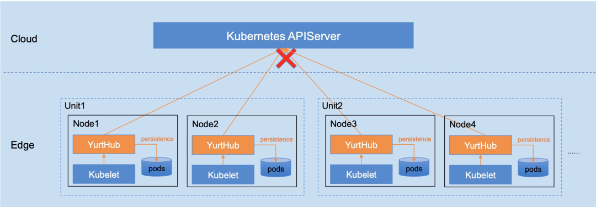

# 深度解读OpenYurt：边缘自治能力设计解析
2020-06-18 **阿里巴巴云原生**

导读：OpenYurt 开源两周以来，以非侵入式的架构设计融合云原生和边缘计算两大领域，引起了不少行业内同学的关注。阿里云推出开源项目 OpenYurt，一方面是把阿里云在云原生边缘计算领域的经验回馈给开源社区，另一方面也希望加速云计算向边缘延伸的进程，并和社区共同探讨未来云原生边缘计算架构的统一标准。
本文将详细介绍OpenYurt的边缘自治能力的设计细节。
## 边缘自治特性

### 1）特性介绍

将 Kubernetes 系统延展到边缘计算场景，边缘节点将通过公网和云端连接，从公网的不稳定性以及成本等因素考虑，边缘要求断网状态或者弱网状态下边缘业务可以持续运行。我们从 Gartner 的边缘计算报告中提到的边缘计算诉求中，边缘自治也是主要诉求之一：

从 Kubernetes 系统架构来看，主要因为 Slave Agent(Kubelet) 中的容器信息保存在内存中，断网状态下因为无法从云端获取业务数据，如果节点或者 Kubelet 重启，将无法进行业务容器恢复。

### 2）边缘自治需要解决的问题
因此边缘自治在Kubernetes系统里，需要解决下面的问题：
- 问题 1：节点异常或重启时，内存数据丢失，网络断连时业务容器无法恢复；

- 问题 2：网络长时间断连，云端控制器对业务容器进行驱逐；

- 问题 3：长时间断连后网络恢复时，边缘和云端数据的一致性保障。

#### 问题1的解决方案1

重构 kubelet 组件，复用或者参考 kubelet 的 checkpoint 功能，持久化容器业务数据到本地磁盘，网络断连状态下利用本地缓存数据实现业务恢复。

该方案经过重构 kubelet，成功解决边缘自治的需求，具备如下优点：

- 通过重构 kubelet，方便在 kubelet 中集成对端设备的管理能力；

- 通过重构 kubelet，可以对 kubelet 进行轻量化改造。此优点但是也意味着原生 kubelet 功能缺失的问题。

但是也有如下不足：

- 可维护性差: 侵入式修改 kubelet core，跟随社区版本升级非常困难，熟悉kubelet的同学都会有同感，kubelet 组件由于直接负责计算，存储，网络交互，所以其代码结构和逻辑异常复杂。因此持续维护一个深度修改过的 kubelet 的工作量可想而知；

- 可扩展性差: 因为自治能力直接做到重构的 kubelet 组件中，这样边缘节点如果其他组件(如网络组件)想复用边缘自治能力将面临重复造轮子的境地；

- 场景耦合更深: 例如在 kubelet 重构中增加了 IOT 设备管理，将可能使 kubelet 和 IOT 场景深度耦合。

#### 问题1的解决方案2（OpenYurt使用方案）

在边缘节点上增加 web 缓存及请求代理 hub(取名为 YurtHub，商业产品中名为 edge-hub)，边缘侧组件(kubelet)和云端通信将经由该组件。YurtHub 相当于带有数据缓存功能的”透明网关“，和云端网络断连状态下，如果节点或者 kubelet 重启，将从 YurtHub 中获取到业务容器相关数据，有效解决边缘自治的问题

相比解决方案1，有如下优势：
- kubelet 零修改，意味原生 kubelet 能力天然具备，同时跟随 Kubernetes 版本升级零负担；

- 可扩展性强，节点其他组件轻松复用 YurtHub；

- 与 Kubernetes 设计理念契合，YurtHub 非常容易扩展出更多的能力。

当然 OpenYurt 的解决方案，也会面临如下的问题：原生 kubelet 比较 high-weight，在资源紧张场景下应用会比较挑战。目前商业产品中节点规格推荐 2U4G 起步。

#### 问题2的解决方案
该问题正是通过开源组件 yurt-controller-manager 中的 Node Controller 来解决的。如 github 主页介绍所示：

#### 问题3的解决方案
Kubernetes 系统中，用户是通过云端对边缘进行管控的(如应用部署，升级，扩缩容等)，因此当边缘和云端网络断联时，边缘节点将不会从云端同步用户对节点的管控操作，因此断网期间，只要 YurtHub 保持本地缓存数据和断网时刻一致(即断网期间边缘缓存数据不更新)，而网络恢复时，再从云端同步最新数据即可。

[原文链接](https://mp.weixin.qq.com/s/4BLfvMJJA623ZwRSgUE69A)
