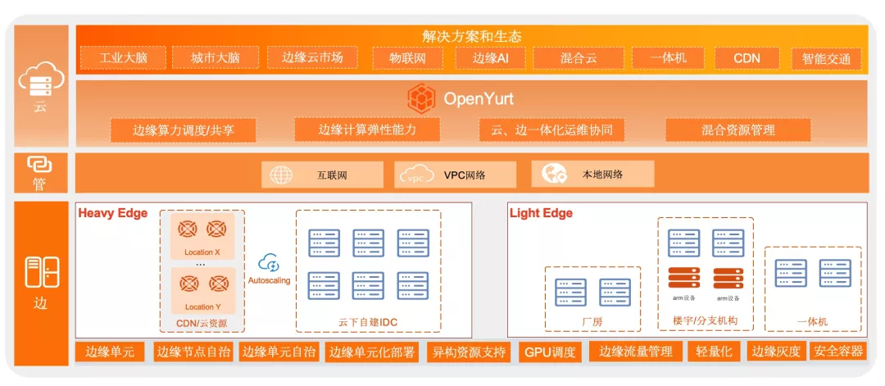

导读：北京时间 5 月 29 日，在阿里云容器服务 ACK@Edge（边缘集群托管服务） 上线一周年之际，阿里巴巴正式宣布将其核心能力开源，并向社区贡献完整的边缘计算云原生项目 -- OpenYurt。

边缘云计算是基于云计算技术的核心和边缘计算的能力，构筑在边缘基础设施之上的新型计算平台，并正在成为行业的新焦点。OpenYurt 作为阿里巴巴首个边缘计算云原生开源项目，汇聚了阿里巴巴众多边缘计算业务团队的深厚技术积累，深度挖掘了边缘计算 + 云原生落地实施诉求。

两年前，OpenYurt 作为公共云服务 ACK@Edge 的核心框架，就已经应用于 CDN、音视频直播、物联网、物流、工业大脑、城市大脑等实际应用场景中，并服务于阿里云 LinkEdge、盒马、优酷、视频云（视频点播、视频直播、实时通信、视频监控、智能视觉）等多个业务或项目中。

阿里巴巴云原生开源负责人、云原生应用平台资深技术专家李响表示：“随着边缘计算的场景和需求不断增加，‘云边协同’、‘边缘云原生’正在逐渐成为新的技术焦点。OpenYurt 开源项目实践‘云边一体化’概念，依托原生 Kubernetes 强大的容器编排、调度能力，实现完全边缘计算云原生基础设施架构，帮助开发者轻松完成在海量边、端资源上的大规模应用的交付、运维、管控。我们希望 OpenYurt 开源能推动社区在云原生和边缘计算交叉领域的协同发展。”
##  什么是OpenYurt

使用 OpenYurt（Yurt，/jɜːrt/，蒙古包）作为本次开源项目名称，期望以其“形”来表示边缘计算侧重于创建一个集中管理但物理分布的基础设施，并支持自动/自治运行操作的含义。

OpenYurt 主打“云边一体化”概念，依托原生 Kubernetes 强大的容器编排、调度能力，通过众多边缘计算应用场景锤炼，实现了一整套对原生 Kubernetes“零”侵入的边缘云原生方案，提供诸如边缘自治、高效运维通道、边缘单元化管理、边缘流量拓扑管理，安全容器、边缘 Serverless/FaaS、异构资源支持等能力。OpenYurt 能帮用户解决在海量边、端资源上完成大规模应用交付、运维、管控的问题，并提供中心服务下沉通道，实现和边缘计算应用的无缝对接。

### 1）OpenYurt诞生背景

从 2017 年底开始，阿里云物联网（IoT）和 CDN (内容分发网络)服务作为典型的边缘计算业务正面临着产品规模的爆发式增长、运维复杂度急剧攀升、运维效率不高的“三难”境地，因此引入云原生理念、全面转型边缘应用的运维管理模式成为亟需解决的问题。

正是在这样的背景下，OpenYurt 诞生于阿里云容器服务团队，并在接下来的两年多时间内，作为公共云服务 ACK@Edge 的核心框架被广泛应用于 CDN、音视频直播、物联网、物流、工业大脑、城市大脑等实际应用场景中，并正在服务于阿里云 LinkEdge、盒马、优酷、视频云（视频点播，视频直播，实时通信，视频监控，智能视觉）等多个业务或项目中。

### 2）OpenYurt技术特点

OpenYurt沿用了目前业界流行的“中心管控、边缘自治”的边缘应用管理架构，将“云边端一体化协同”作为目标，赋能云原生能力向边缘端拓展。在技术实现上，OpenYurt贯彻了“Extending your native Kubernetes to Edge”的核心设计理念，其技术方案有如下特点：
- 对原生Kubernetes“零”侵入，保证对原生k8s API的完全兼容。

OpenYurt通过proxy node network traffic，对 Kubernetes 节点应用生命周期管理加了一层新的封装，提供边缘计算所需要的核心管控能力；

- 无缝转换，OpenYurt提供了工具将原生Kubernetes“一键式”转换成支持边缘计算能力的 Kubernetes 集群；

- 低Overhead，OpenYurt参考了大量边缘计算场景的实际需求，在保证功能和可靠性的基础上，本着最小化，最简化的设计理念，严格限制新增组件的资源诉求。  

### 3）OpenYurt核心能力

- 边缘自治能力： 

YurtHub作为节点上的临时配置中心，在网络连接中断的情况下，持续为节点上所有设备和客户业务提供数据配置服务。YurtHub 提供了对大量原生 Kubernetes API的支持，可以在节点和边缘单元维度提供“ShadowApiserver”的能力，在边缘计算弱网络链接场景的价值尤为突出；

- 边缘运维通道

在边缘场景，由于大多数边缘节点没有暴露在公网之上，中心管控无缝和边缘节点主动建立网络链接，所有的Kubernetes原生应用运维APIs（logs/exec/metrics）会失去效力；
YurtTunnel 通过在管控与边缘节点之间建立反向通道，并和节点的生命周期完整联动，承载原生运维 APIs 的流量；

- 集群转换能力
Yurtctl作为OpenYurt官方命令行工具，提供原生Kubernetes集群支持边缘计算infrastructure的一键式切换。

其他更高级的功能比如边缘流量管理、单元化管理，部署、区域自治等将会逐步开源。

### 4）OpenYurt Roadmap
作为阿里云容器服务 ACK@Edge 的开源版本，OpenYurt 将采用全开源社区开发模式，每季度发布新版本更新，包含社区上游安全/关键 bug 修复和新特性、新能力，并逐步将产品完整能力开源。

主导这次开源的阿里巴巴云原生应用平台团队，目前已经开源 OAM、OpenKruise、Dragonfly、Apache RocketMQ、Apache Dubbo 等众多明星项目，是国内最资深的云原生开源贡献团队。OpenYurt 项目的开源，本着“Extending your native Kubernetes to Edge”的设计理念，让云原生技术在边缘计算领域的生态建设与普及前进了一大步，也为全球开发者拓展云原生边界贡献了一份力量。

[原文链接](https://mp.weixin.qq.com/s/0LwCE4CpVdttmvx4FAMArg)