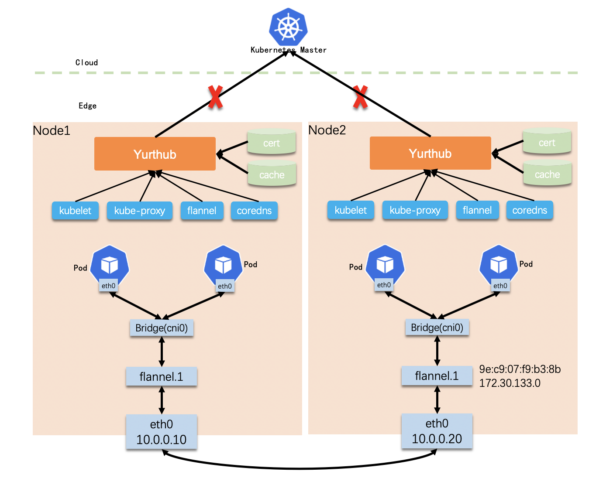

## 背景说明

在边缘场景中，为了确保云边网络断开时节点上的业务仍能稳定运行，OpenYurt提供了边缘节点自治功能。该功能能够实现云边断网情况下，业务Pod的异常自动重启、节点重启自动拉起业务Pod等功能。然而，为了保证云边断网后业务Pod和节点的重启不影响边边的容器网络，这里有一些网络情况需要适配。

## Flannel： VTEP MAC地址保持
### 场景
如果我们使用flannel作为CNI插件，且后端为VXLAN模式。在节点上会创建一个VTEP设备（通常命名为": flannel.1），同时VNI和VTEP的信息会被记录到节点的annotations中，供其它节点创建相应的路由和转发规则。



Flannel的架构如图所示，我们用两个边缘节点来举例说明：
- node2创建flannel.1设备，MAC地址为"9e:c9:07:f9:b3:8b"，IP地址为"172.30.133.0"，那么node2的annotations中有如下记录。
```yaml
# node2 annotations with vtep info.
flannel.alpha.coreos.com/backend-data: '{"VtepMAC":"9e:c9:07:f9:b3:8b"}'
flannel.alpha.coreos.com/public-ip: 10.0.0.20
```
- node1 将使用node2的这些信息，在主机上配置fdb、arp以及路由信息
```shell script
# node1 host network namespace.
fdb:   9e:c9:07:f9:b3:8b dev flannel.1 dst 10.0.0.20 self permanent
arp:   ? (172.30.133.0) at 9e:c9:07:f9:b3:8b [ether] PERM on flannel.1
route: 172.30.133.0/26 via 172.30.133.0 dev flannel.1 onlink
```
每当node2重启之后，flannel会重新创建VTEP设备，VTEP的MAC地址也发生变化，并更新到node2的annotations中。然而，如果此时node2或者node1与云端的网络断开，node1将不能感知到node2的MAC地址的变化，这将导致node1与node2上的Pod无法正常通信。

### 解决方法： 在Flannel中增加MAC地址保持功能
每次节点重启时，flannel优先读取本节点annotations中MAC地址信息（从apiserver或者yurt-hub的本地缓存中读取），如果存在则使用这个MAC地址作为VTEP的MAC地址。
为了实现这个能力，需要对flannel的代码做改动，参考如下：
```shell script
git clone https://github.com/flannel-io/flannel.git ;
cd flannel;
git reset --hard e634dabe0af446b765db3b729085b32f97ff6fe6;
wget https://raw.githubusercontent.com/openyurtio/openyurt/master/docs/tutorial/0001-flannel-keep-vtep-mac.patch;
git am 0001-flannel-keep-vtep-mac.patch;
```

## IPAM: Pod IP地址保持
### 场景
在大多数场景中，使用host-local为Pod分配IP地址。host-local从nodecidr中选择空闲的IP地址分配给新的Pod，并将已分配的IP地址信息记录在本地文件中。
例如，如果IPAM的数据目录为/var/lib/cni/networks/cbr0, 它的记录信息如下：
```shell script
$ ls /var/lib/cni/networks/cbr0
172.30.132.194  172.30.132.198  172.30.132.201
```
当云边断网时，Pod重启会导致host-local重新分配IP地址，且Pod IP地址的变化无法同步到云端，其它边缘节点上的kube-proxy等组件无法感知到Pod IP的变化，则无法使用Cluster IP地址访问业务Pod。

### 解决办法： Pod IP地址保持
为了解决这个问题，需要调整host-local的代码：记录IP地址的格式为{ip}-{pod namespace}-{pod name}。当pod重启时，host-local将优先使用记录中同名Pod的IP地址。
调整后的已分配的Pod IP记录如下：
```shell script
$ ls /var/lib/cni/networks/cbr0
172.30.132.194_kube-system_coredns-vstxh  172.30.132.198_kube-system_nginx-76df748b9-4cz95  172.30.132.201_kube-system_nginx-76df748b9-nf5l9
```
host-local的代码修改参考:
```shell script
git clone https://github.com/containernetworking/plugins.git ;
cd plugins;
git reset --hard 9ebe139e77e82afb122e335328007bca86905ae4;
wget https://raw.githubusercontent.com/openyurtio/openyurt/master/docs/tutorial/0002-ipam-keep-pod-ip.patch;
git am 0002-ipam-keep-pod-ip.patch;
```
## 为flannel增加"get node"权限
flannel调整之后，需要在原有的RBAC之后，提供 "get node"的权限。参考：
```diff
kind: ClusterRole
apiVersion: rbac.authorization.k8s.io/v1beta1
metadata:
  name: flannel
rules:
  - apiGroups:
      - ""
    resources:
      - pods
    verbs:
      - get
  - apiGroups:
      - ""
    resources:
      - nodes
    verbs:
+     - get
      - list
      - watch
  - apiGroups:
      - ""
    resources:
      - nodes/status
    verbs:
      - patch
```
